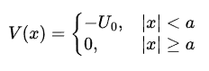

# Solving the Schrödinger Equation for a Rectangular Potential Well  

## Problem Statement  

Using the Schrödinger equation, we need to find the **bound states** and the corresponding **eigenvalues** for a **rectangular potential well** given by:  

where **a** is the well width. Additionally, we need to plot the **wavefunctions** of the eigenstates.  

## Approach  

### 1. Schrödinger Equation  

We solve time-independent Schrödinger equation in two regions:

- **Inside the well** |x| < a  
- **Outside the well** |x| >= a  

### 2. Wavefunction Solutions  

The general solution consists of:  
- Sinusoidal functions inside the well.  
- Exponential decay outside the well.  

The wavefunctions must satisfy **continuity conditions** at the boundaries x = +- a .  

### 3. Energy Quantization  

Applying boundary conditions leads to transcendental equations that determine the allowed energy levels **\( E_n \)**. These are found numerically.  

### 4. Visualization  

Once the eigenfunctions are determined, they are plotted to visualize the quantized wave states inside the well.  
